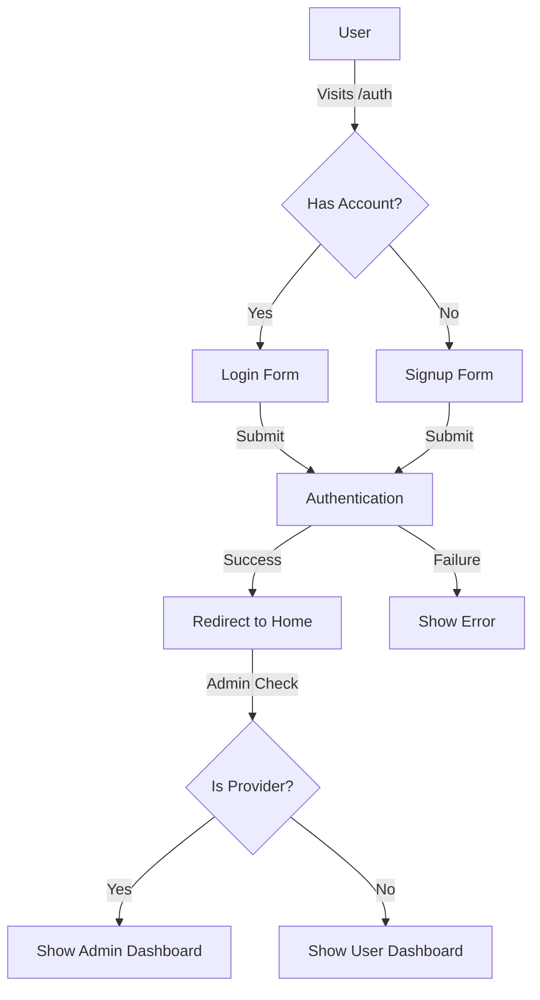

# PiEat-Me: Modern Food Delivery Platform with Pi Network Integration

<div align="center">
  
  <h3>The Next-Generation Food Delivery App with Cryptocurrency Support</h3>
</div>

## ✨ Project Overview

PiEat-Me is a comprehensive food delivery platform built on the Pi Network ecosystem. It connects users with both traditional restaurants and home-based food providers, enabling seamless payments via Pi cryptocurrency. The platform features a dual-marketplace model, integrated wallet systems, and a reward mining feature.

## 🚀 Quick Start Guide

### Setting Up Your Account

1. **Create a User Account**:
   - Visit the `/auth` page in the application
   - Choose "Register" and complete the signup form
   - Verify your email address if required

2. **Admin Access**:
   - After creating your account, an administrator needs to enable provider privileges
   - This is done in the Supabase dashboard by setting `is_provider = true` in your profile

### Supabase Admin Setup Instructions

To make a user an admin/provider:

1. Log in to your [Supabase Dashboard](https://supabase.com/dashboard)
2. Select your PiEat-Me project
3. Go to "Table Editor" → "profiles" table
4. Find the user's record and edit the `is_provider` field to `true`
5. Save the changes
6. The user will now have access to admin features on their next login

## 🌟 Key Features

- **Dual Marketplace System**
  - Order from traditional restaurants 
  - Order from home-based food providers

- **Cryptocurrency Integration**
  - Pay using Pi Network cryptocurrency
  - Integrated wallet system for transactions

- **Multi-wallet System**
  - Pi Network wallet for cryptocurrency
  - PiEat wallet for platform rewards

- **Interactive Mining System**
  - Earn PiEat tokens (PTM) through in-app activities

- **Internationalization**
  - Full support for English and Arabic
  - RTL language support

- **Responsive Design**
  - Optimized for mobile and desktop devices
  - Progressive Web App capabilities

## 🔧 Development Setup

### Prerequisites

```bash
# Required tools
Node.js (v16+)
npm or bun
Git
```

### Installation

```bash
# Clone the repository
git clone <repository_url>
cd pieat-me

# Install dependencies
npm install
# OR using bun (faster)
bun install

# Set up environment variables
cp .env.example .env
# Edit .env with your Supabase credentials

# Start development server
npm run dev
```

### Build and Deployment

```bash
# Development build
npm run build:dev

# Production build
npm run build

# Preview production build
npm run preview
```

## 📂 Project Structure Map

```
PiEat-Me/
├── public/                   # Static files and assets
│   ├── lovable-uploads/      # Uploaded images
│   └── manifest.json         # PWA manifest
│
├── src/
│   ├── backend/              # Backend services
│   │   └── services/         # API services
│   │
│   ├── components/           # Reusable UI components
│   │   ├── cart/             # Cart components
│   │   ├── food-provider/    # Food provider components
│   │   ├── header/           # Header & navigation
│   │   ├── home/             # Home page sections
│   │   ├── mining/           # Mining feature components
│   │   ├── restaurant/       # Restaurant components
│   │   └── ui/               # shadcn/ui components
│   │
│   ├── contexts/             # React context providers
│   │   ├── AdminAuthContext.tsx   # Admin authentication 
│   │   ├── SupabaseAuthContext.tsx # User authentication
│   │   ├── PiAuthContext.tsx # Pi Network auth
│   │   ├── CartContext.tsx   # Shopping cart
│   │   └── [Other contexts]  # Various app contexts
│   │
│   ├── hooks/                # Custom React hooks
│   │
│   ├── integrations/         # Third-party integrations
│   │   └── supabase/         # Supabase integration
│   │
│   ├── locales/              # Translation files
│   │   ├── ar.json           # Arabic translations
│   │   └── en.json           # English translations
│   │
│   ├── pages/                # Application pages
│   │   ├── Index.tsx         # Home page
│   │   ├── Auth.tsx          # Authentication page
│   │   ├── Wallet.tsx        # Wallet management
│   │   ├── HomeFood.tsx      # Home food marketplace
│   │   ├── Restaurants.tsx   # Restaurant marketplace
│   │   ├── admin/            # Admin dashboard
│   │   └── [Other pages]     # Various app pages
│   │
│   ├── App.tsx               # Main application component
│   └── main.tsx              # Application entry point
│
├── supabase/                 # Supabase configuration
├── capacitor.config.ts       # Mobile configuration
├── tailwind.config.ts        # Tailwind CSS config
└── vite.config.ts            # Vite configuration
```

## 🔄 Authentication Flow



## 💻 Technology Stack

- **Frontend**: React, TypeScript, Vite
- **UI Components**: shadcn/ui, Tailwind CSS
- **State Management**: React Context API, TanStack Query
- **Routing**: React Router
- **Backend**: Supabase
- **Authentication**: Supabase Auth, Pi Network SDK
- **Database**: PostgreSQL (via Supabase)
- **Payment**: Pi Network SDK
- **Mobile**: Progressive Web App, Capacitor

## 🌐 Integration Points

- **Pi Network**: Authentication and payments
- **Supabase**: Database, authentication, storage
- **Recharts**: Data visualization for admin dashboard

## 🛠️ Support & Documentation

For additional documentation:
- **Frontend**: See `src/frontend/README.md`
- **Backend**: See `src/backend/README.md`
- **API Documentation**: Available in the admin dashboard

## 📱 Mobile Deployment

The application supports installation as a Progressive Web App (PWA) on mobile devices and can be built as native applications using Capacitor.

## 📊 Database Schema

The application uses Supabase with the following primary tables:
- `auth.users`: Managed by Supabase Auth
- `profiles`: User profile information
- `restaurants`: Restaurant listings
- `menu_items`: Food items available for order
- `orders`: User order information
- `order_items`: Items within each order

## 🔑 License

This project is licensed under the MIT License.
